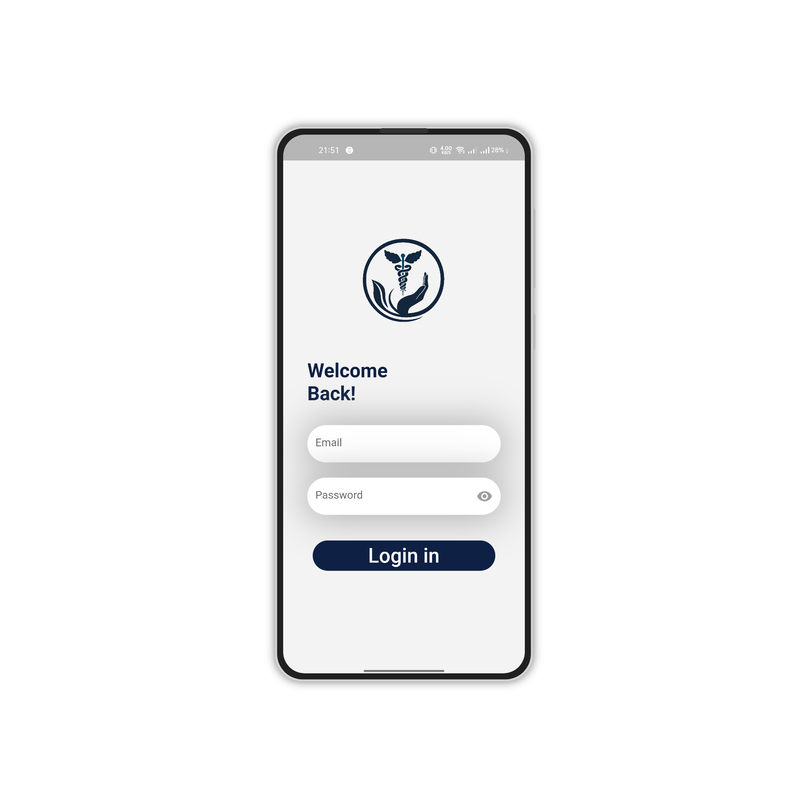
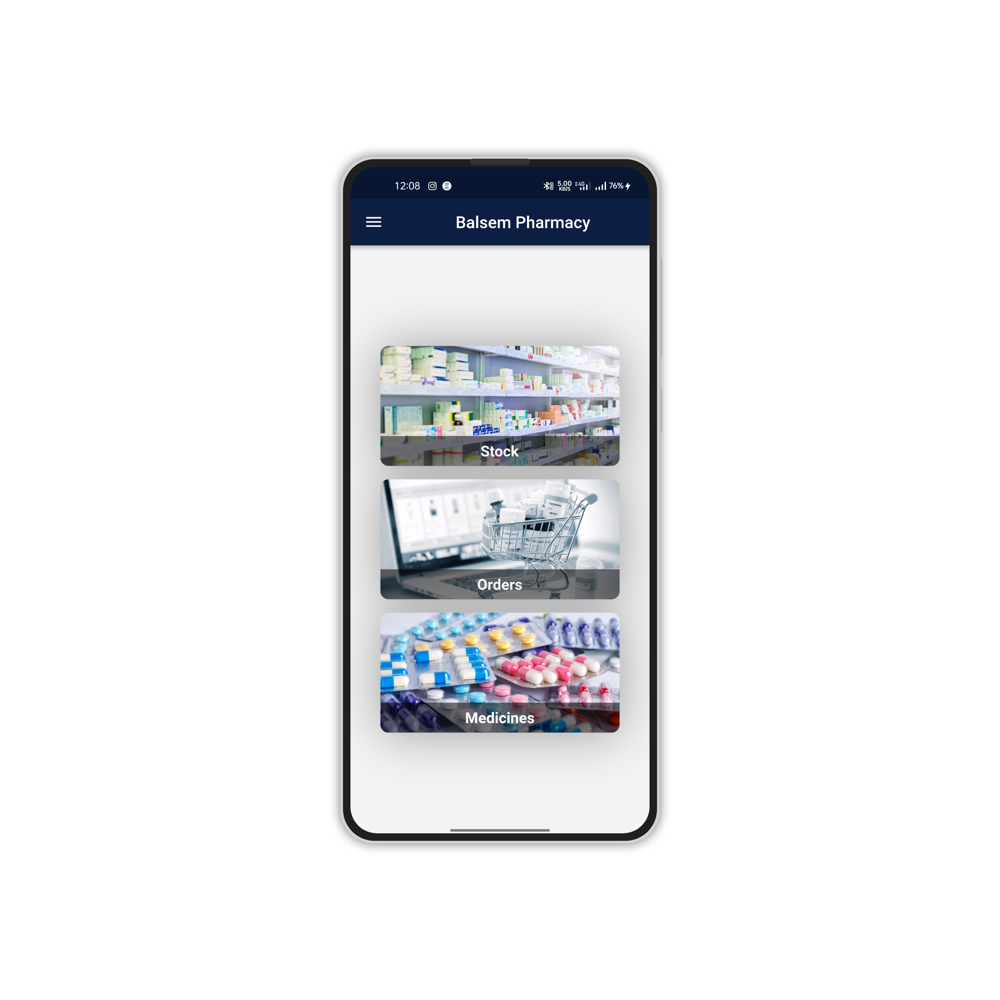
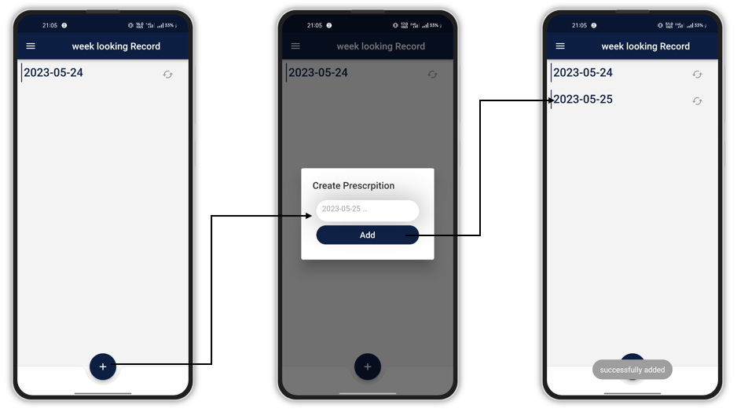
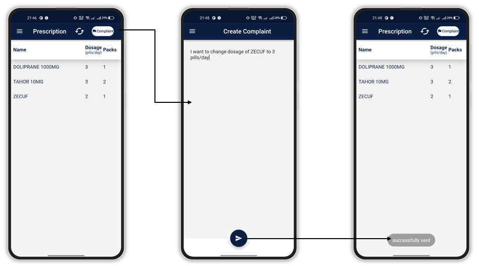
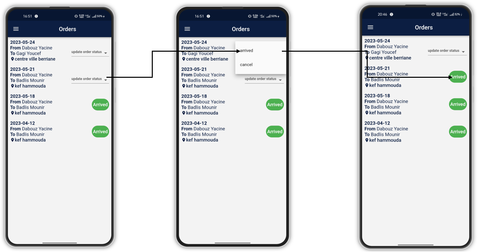

# untitled

A new Flutter project.

## Getting Started

This is project of end of study, we talking about telehealth domain.
in this project we have four types of users admin, doctor, pharmacist and patient, and each one of them can do a several functions.
the admin can:
- manage doctors accounts(add a new doctor, modify informations, remove a doctor).
- manage pharmacists accounts(add a new pharmacist, modify informations, remove a pharmacist).
- manage patients accounts(modify informations, remove a patient).
the doctor can:
- add a new patient if not exist.
- create a medical record for patient.
- create a new prescription for patient.
- Send the prescription to a specific pharmacy by seeing that available pharmacies (basic on the medicine availability and the enough quantity).
- possiblity of modify dosage of the medicine.
- possiblity of renew a prescription.
- view the patients's complaints and reply.
- seeing the current medicines on the market.
the pharmacist can:
- manage his stock(add a new medicine, modify quantity, remove a medicine).
- manage the orders that coming from doctors(accept or refuse, arriving).
- seeing the currznt medicines and possibility to add a new medicine.
the patient can:
- view his records and prescriptions.
- possibility of send a compalints.
- possibility of send a renewal request.
- view status of his orders.
- view status of his complaints(panding, replied and seeing the reply).

Here's some screenshots of our app:

